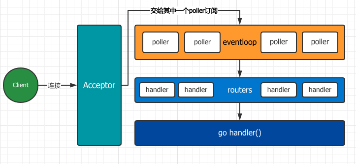
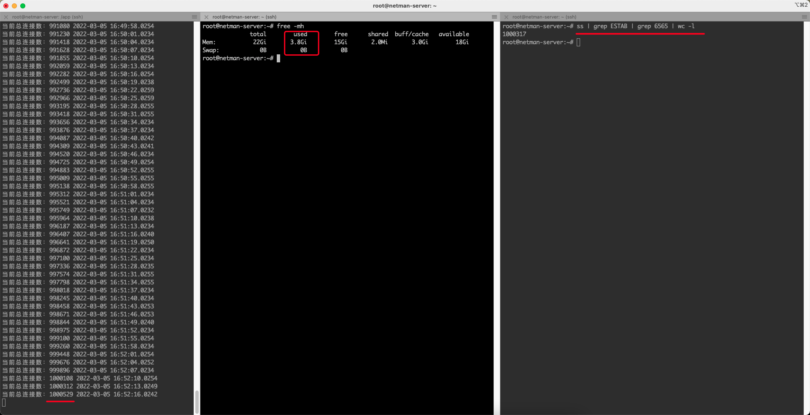

# 目录

* [目录](#目录)
    * [介绍](#介绍)
    * [优势](#优势)
    * [安装](#安装)
    * [封包](#封包packer)
    * [TCP](#tcp-server)
    * [UDP](#UDP)
    * [Websocket](#websocket)
    * [中间件](#中间件)
    * [配置](#配置)
        * [心跳](#心跳检测)
        * [包体最大长度](#包体最大长度)
        * [TCP Keepalive](#tcp-keepalive)
        * [TLS](#TLS)
        * [自定义封包解包](#自定义封包解包)
        * [组合使用](#组合使用)
    * [架构](#架构)
    * [百万连接](#百万连接)

## 介绍

- 轻量的高性能TCP网络框架，基于epoll/kqueue，reactor模型实现
- 简单的API，细节在框架内部实现，几行代码即可构建高性能的Server
- 支持路由配置，更专注业务需求的处理，无需关心封包解包
- 支持自定义封包格式，更灵活
- 支持linux/macos，windows请在docker中运行
- 支持TLS
- 支持websocket
- 中间件

## 优势

- 非阻塞IO
- 底层基于事件循环，在`net`包中，一个连接需要一个`goroutine`去维持，但`netman`基于事件循环则不需要，大大减少了内存的占用，在大量连接的场景下更为明显
- 基于路由配置，业务层不关心封包解包的实现
- 全局中间件、分组中间件
- 经过测试在阿里云服务器(单机)上建立100万个连接（C1000K）的内存消耗在`3.8GB`左右

## 安装

```bash
go get -u github.com/ikilobyte/netman
```

## 封包（Packer）

* 框架默认实现的封包规则是：包头 + MsgID + 包体，其中`包头：4Byte`用于表示包体长度，`MsgID：4Byte`，均使用`LittleEndian`
* 你也可以使用自己的封包规则，只需在启动是传入配置即可

## TCP Server

```go
package main

import (
	"fmt"
	"github.com/ikilobyte/netman/iface"
	"github.com/ikilobyte/netman/server"
	"time"
)

type Hello struct {
}

func (h *Hello) Do(request iface.IRequest) {

	// 消息内容
	body := request.GetMessage().Bytes()

	// 当前连接
	connect := request.GetConnect()

	// 所有连接（包含当前连接）
	connections := request.GetConnects()

	fmt.Println(body, connect, connections)

	// 发送消息
	n, err := connect.Send(0, []byte("hello world"))
	fmt.Printf("written %d err %v", n, err)

	// 关闭连接
	connect.Close()
}

type Hooks struct {
}

func (h *Hooks) OnOpen(connect iface.IConnect) {
	fmt.Printf("connect onopen %d\n", connect.GetID())
}

func (h *Hooks) OnClose(connect iface.IConnect) {
	fmt.Printf("connect closed %d\n", connect.GetID())
}

func main() {
	s := server.New(
		"0.0.0.0",
		6650,

		// 以下配置都是可选的，更多配置请看 Options
		// 包体最大长度
		server.WithMaxBodyLength(1024*1024*100),

		// Hooks
		server.WithHooks(new(Hooks)),

		// 使用自己的封包规则
		// server.WithPacker(new(xxx))

		// 开启TLS
		//server.WithTLSConfig(&tls.Config{Certificates: nil})

		// 心跳检测（允许连接的空闲时间），需要同时配置才能生效
		server.WithHeartbeatIdleTime(time.Hour*5),
		server.WithHeartbeatCheckInterval(time.Second*5),
	)

	// 添加路由
	s.AddRouter(0, new(Hello)) // 消息ID为0的处理方法
	//s.AddRouter(1,new(xxx))

	s.Start()
}
```

## TCP Client

> 本框架并没有特意去封装`client`，各语言的`tcp client`都可以连接，下面使用`go`
> 语言作为示例，该示例只是为了体现如何使用，请勿用于生产环境!

```go
package main

import (
	"fmt"
	"github.com/ikilobyte/netman/util"
	"io"
	"log"
	"net"
)

func main() {
	conn, err := net.Dial("tcp", "127.0.0.1:6565")
	if err != nil {
		log.Panicln(err)
	}

	// 使用默认的消息封包实现，当然你也可以自行实现
	packer := util.NewDataPacker()
	body, err := packer.Pack(0, []byte("hello world"))
	if err != nil {
		log.Panicln(err)
	}

	// 发送消息
	_, err = conn.Write(body)
	if err != nil {
		log.Panicln(err)
	}

	// 读取消息
	head := make([]byte, 8)
	_, err = io.ReadFull(conn, head)
	if err != nil {
		log.Panicln(err)
	}

	// 使用packer解析出message
	message, err := packer.UnPack(head)
	if err != nil {
		log.Panicln(err)
	}

	// 根据消息长度读取包体
	buff := make([]byte, message.Len())
	n, err := conn.Read(buff)
	if err != nil {
		log.Panicln(err)
	}
	fmt.Printf("recv %s \n", buff[:n])
	conn.Close()
}
```

## UDP

> 使用方式和tcp一致，框架层做了适配，将udp结合`epoll`，实现udp高并发

- [server example](https://github.com/ikilobyte/netman/blob/main/examples/udp/server/main.go)
- [client example](https://github.com/ikilobyte/netman/blob/main/examples/udp/client/main.go)

## Websocket

* server
* 已使用[crossbario/autobahn-testsuite](https://github.com/crossbario/autobahn-testsuite)测试用例并通过，可自行测试

```go
package main

import (
	"fmt"
	"github.com/ikilobyte/netman/iface"
	"github.com/ikilobyte/netman/server"
)

type Handler struct{}

// Open 连接建立时
func (h *Handler) Open(connect iface.IConnect) {

	// 获取query参数
	query := connect.GetQueryStringParam()

	// 客户端连接的url应该设置为：ws://ip:port/path?key=value&token=xxx
	// 支持任意path，如：ws://ip:port/x/y/z/a/b/c?key=value&token=xxx
	if query.Get("token") != "xxx" {
		connect.Close()
		return
	}

	fmt.Println("onopen", connect.GetID())
}

// Message 消息到来时
func (h *Handler) Message(request iface.IRequest) {

	// 消息
	message := request.GetMessage()

	// 当前连接
	connect := request.GetConnect()

	// 判断是什么消息类型
	if message.IsText() {
		// 发送文本消息
		fmt.Println(connect.Text(message.Bytes()))
	} else {
		// 发送二进制消息
		fmt.Println(connect.Binary(message.Bytes()))
	}
}

// Close 连接关闭时
func (h *Handler) Close(connect iface.IConnect) {
	fmt.Println("onclose", connect.GetID())
}

func main() {
	s := server.Websocket(
		"0.0.0.0",
		6565,
		new(Handler), // websocket事件回调处理
	)  
	s.Start()
}
```

* client
* 各语言的Websocket Client库即可，如Javascript的 `new Websocket`
* [`client.html`](./examples/websocket/client.html)

## 中间件

* 可被定义为`全局中间件`，和`分组中间件`，目前websocket只支持`全局中间件`
* 配置中间件后，接收到的每条消息都会先经过中间件，再到达对应的消息回调函数
* 中间件执行顺序，`全局中间件`->`分组中间件`
* 中间件可提前终止执行

### 定义中间件

```go
package main

import "github.com/ikilobyte/netman/iface"
import "fmt"
import "time"

// 用作全局中间件
func global() iface.MiddlewareFunc {
	return func(ctx iface.IContext, next iface.Next) interface{} {

		fmt.Println("Front middleware")
		fmt.Println("ctx data", ctx.GetConnect(), ctx.GetRequest(), ctx.GetMessage())

		ctx.Set("key", "value")
		ctx.Set("now", time.Now().UnixNano())

		// 继续往下执行
		resp := next(ctx)

		fmt.Println("Rear middleware")
		return resp
	}
}

// 用作分组中间件
func space() iface.MiddlewareFunc {
	return func(ctx iface.IContext, next iface.Next) interface{} {
		fmt.Println(ctx.Get("key"),ctx.Get("now"))
		return next(ctx)
	}
}
```

### 使用中间件

```go
package main

import "github.com/ikilobyte/netman/server"

func main() {
	s := server.New("0.0.0.0",6565)
	
	// 全局中间件
	s.Use(global())

	// 分组，只有对应的路由才会执行
	g := s.Group(space())
	{
		g.AddRouter(1, new(xxx))
		//g.AddRouter(2,new(xxx))
		//g.AddRouter(3,new(xxx))
	}
}
```

## 配置

* 所有配置对 `Tcp（TLS）`、`UDP`、`Websocket` 都是生效的
* 更多配置请查看 [`options.go`](./server/options.go)

### 心跳检测

* 二者需要同时配置才会生效

```go
server.New(
	"0.0.0.0", 6565,
    // 表示60秒检测一次
    server.WithHeartbeatCheckInterval(time.Second*60),

    // 表示一个连接如果180秒内未向服务器发送任何数据，此连接将被强制关闭
    server.WithHeartbeatIdleTime(time.Second*180),
)
```

### 包体最大长度

```go
server.New(
    "0.0.0.0",
    6565,

    // 0表示不限制长度
    // 这里配置的是100MB，当某条消息超过100MB时，会被拒绝处理
    server.WithMaxBodyLength(1024*1024*100),
)
```

### TCP Keepalive

* 参考：https://zh.wikipedia.org/wiki/Keepalive

```go
server.New(
    "0.0.0.0",
    6565,
    
    server.WithTCPKeepAlive(time.Second*30),
)
```

### TLS

```go
tlsConfig := &tls.Config{
    Certificates: []tls.Certificate{...},
}

s := server.New(
    "0.0.0.0",
    6565,

    // 传入相关配置后，即可开启TLS
    server.WithTLSConfig(tlsConfig),
)
```

### 自定义封包解包

* 为了更灵活的需求，可自定义封包解包规则，只需要使用`IPacker`接口即可
* 配置

```go
// IPacker 定义（框架内部已经定义，你只需要实现即可）
type IPacker interface {
    Pack(msgID uint32, data []byte) ([]byte, error) // 封包
    UnPack([]byte) (IMessage, error) // 解包
    SetMaxBodyLength(uint32) // 设置包体最大长度限制
    GetHeaderLength() uint32 // 获取头部长度
}

type YouPacker struct {
// implements IPacker
// ... 
}

server.New(
    "0.0.0.0",
    6565,
    
    // 自定义Packer
    server.server.WithPacker(new(YouPacker)),
)
```

### 组合使用

```go
server.New(
    "0.0.0.0",
    6565,
    server.WithNumEventLoop(runtime.NumCPU()*3),
    server.WithHooks(new(Hooks)),            // hooks
    server.WithMaxBodyLength(0),             // 配置包体最大长度，默认为0（不限制大小）
    server.WithTCPKeepAlive(time.Second*30), // 设置TCPKeepAlive
    server.WithLogOutput(os.Stdout), // 框架运行日志保存的地方
    server.WithPacker(new(YouPacker)), // 可自行实现数据封包解包
    
    // 心跳检测机制，二者需要同时配置才会生效
    server.WithHeartbeatCheckInterval(time.Second*60), // 表示60秒检测一次
    server.WithHeartbeatIdleTime(time.Second*180), // 表示一个连接如果180秒内未向服务器发送任何数据，此连接将被强制关闭
    
    // 开启TLS
    server.WithTLSConfig(tlsConfig),
)
```

## 架构



## 百万连接

* 如看不到图片可以在`examples`目录中查看`c1000k.png`这张图片
  

## 鸣谢

感谢 JetBrains 为此开源项目提供 GoLand 开发工具支持：

