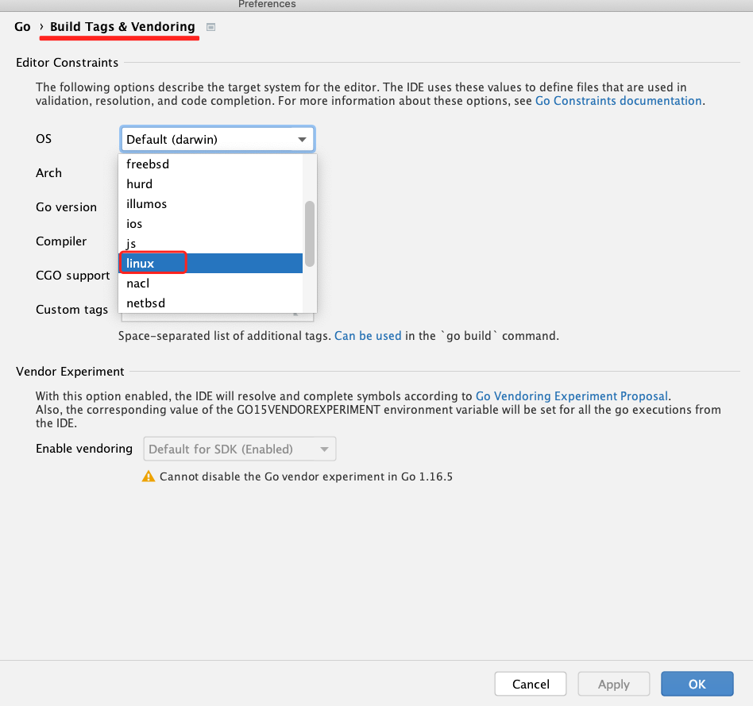

### 有什么优势
- Go的net包底层也是基于epoll，但未对外开放相关epoll的处理，目的是简化开发流程
- 在业务中通常是一个连接过来后，业务层开启一个`goroutine`来处理这个连接的请求，处理大量连接的同时也会开启大量的`goroutine`
- GMP模型中如果存在大量的`goroutine`其实会影响到调度，本地P存储的G数量是有限的
- 在大多数场景下，连接建立后并不是一直都在发送消息，所以通过epoll处理后，只处理有事件的连接

### 是什么
- 轻量级的高性能TCP网络框架，基于epoll/kqueue，reactor模型实现
- 支持路由配置，更专注业务需求的处理，无需关心封包解包
- 支持自定义封包格式，更灵活
- 支持linux/macos，暂不支持windows，windows请在docker中运行

### 架构图


> windows用户查看代码可以在goland中设置一下Build Tags，这样就有 unix.* 相关的代码提示
> 



### 开始
```bash
go get github.com/ikilobyte/netman
```


### server端
```go
package main

import (
	"fmt"
	"os"
	"runtime"

	"github.com/ikilobyte/netman/iface"

	"github.com/ikilobyte/netman/server"
)

type Hooks struct{}

func (h *Hooks) OnOpen(connect iface.IConnect) {
	fmt.Printf("connId[%d] onOpen\n", connect.GetID())
}

func (h *Hooks) OnClose(connect iface.IConnect) {
	fmt.Printf("connId[%d] onClose\n", connect.GetID())
}

type HelloRouter struct {
	server.BaseRouter
}

func (h *HelloRouter) Do(request iface.IRequest) {
	conn := request.GetConnect()
	msg := request.GetMessage()
	fmt.Println("recv", msg.String())
	n, err := conn.Write(msg.ID(), []byte(fmt.Sprintf("server resp %s", msg.String())))
	fmt.Println(n, err)
}

func main() {

	fmt.Println(os.Getpid())

	// 构造
	s := server.New(
		"0.0.0.0",
		6565,
		server.WithNumEventLoop(runtime.NumCPU()*3),
		server.WithHooks(new(Hooks)), // hook
		//server.WithPacker(new(CustomPacker)) // 配置自定义的封包解包，覆盖框架默认规则
	)

	// 根据业务需求，添加路由
	s.AddRouter(0, new(HelloRouter))
	//s.AddRouter(1, new(XXRouter))
	// ...

	// 启动
	s.Start()
}
```

### client端
```go
package main

import (
	"fmt"
	"io"
	"net"
	"time"

	"github.com/ikilobyte/netman/util"
)

func main() {

	conn, err := net.Dial("tcp", "127.0.0.1:6565")
	if err != nil {
		panic(err)
	}

	packer := util.NewDataPacker()

	go func() {
		for {

			// 默认的封包解包规则
			header := make([]byte, 8)
			_, err := io.ReadFull(conn, header)
			if err != nil {
				fmt.Println("read head err", err)
				continue
			}

			// 解包头部
			message, err := packer.UnPack(header)
			if err != nil {
				fmt.Println("unpack err", err)
				continue
			}

			// 创建一个和数据大小一样的bytes并读取
			dataBuff := make([]byte, message.Len())
			_, err = io.ReadFull(conn, dataBuff)
			if err != nil {
				fmt.Println("read dataBuff err", err)
				continue
			}
			message.SetData(dataBuff)

			fmt.Printf("recv msgID[%d] len[%d] %q \n", message.ID(), message.Len(), message.String())
		}
	}()

	for {

		bs, err := packer.Pack(0, []byte(fmt.Sprintf("hello netMan %s", time.Now().Format("2006-01-02 15:04:05.0000"))))
		if err != nil {
			panic(err)
		}
		conn.Write(bs)
		time.Sleep(time.Second * 1)
	}

}
```